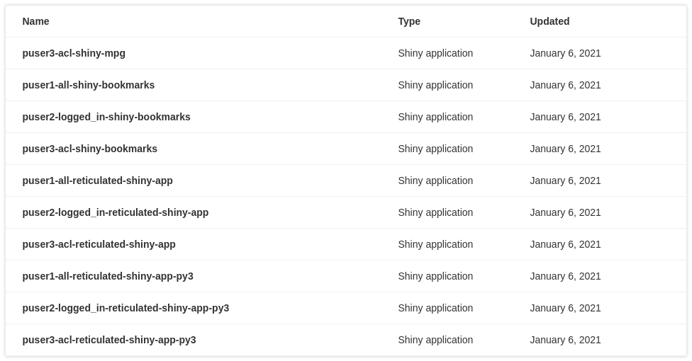

rscpages: Curate your content on RStudio Connect
================================================

<!-- badges: start -->

[](https://CRAN.R-project.org/package=rscpages)
[](https://lifecycle.r-lib.org/articles/stages.html#experimental)
[](https://github.com/rstudio/rscpages/actions)
<!-- badges: end -->

## Overview

You can use the `rscpages` package to curate your content on RStudio Connect,
helping to create organized groups of content within an RMarkdown document or
Shiny app.

**NOTE: This package is still in alpha and is not ready for any production
usage. Things will change, things might break, etc**

## Installation

This package has not been released to CRAN yet and must be installed from
GitHub:

``` r
# install.packages("devtools")
devtools::install_github("rstudio/rscpages")
```

## Usage

`{rscpages}` provides UI components (see
[htmlwidgets](https://www.htmlwidgets.org/)) to help publishers provide curated
organization of content on RStudio Connect.

### Connecting to RStudio Connect

You can specify the RStudio Connect server and your API key using the `connect`
function. All methods used for fetching data require the returned client from
`connect` as the first argument, which naturally encourages the use of pipes.

``` r
library(rscpages)

client <- connect(server = 'rsconnect.example.com', api_key = 'abcdef123456789')
```

Although you can provide `server` and `api_key` to the `connect(...)` function
directly for quickly getting started, it is recommended to use environment
variables in production. The environment variables `CONNECT_SERVER` and
`CONNECT_API_KEY` will be used automatically if they are present. In your
development environment, these can be conveniently set in an `.Renviron` as
outlined in this
[article](https://support.rstudio.com/hc/en-us/articles/360047157094-Managing-R-with-Rprofile-Renviron-Rprofile-site-Renviron-site-rsession-conf-and-repos-conf).
When deploying to RStudio Connect, these environment variables will be
automatically provided - no steps necessary\!

``` r
library(rscpages)

# You could also have provided these in an .Renviron, but setting here for the sake
# of example
Sys.setenv(CONNECT_SERVER = "rsconnect.example.com")
Sys.setenv(CONNECT_API_KEY = "abcdef1234567890")

client <- connect()
```

### Fetching Content

The `content` method returns a data frame of the content available on the
RStudio Connect server. You can further use
[dplyr](https://dplyr.tidyverse.org/) or built-in R functions to filter, mutate,
and arrange the data frame for your own purposes.

``` r
all_content <- client %>% content()
```

``` r
library(dplyr)

recent_content <- all_content %>%
  arrange(desc(created_time)) %>%
  top_n(10)
```

**Note About Permissions:** If you are using the API key of an administrator,
all content on the RStudio Connect server will be available; however, if you are
using a publisher API key, only the content visible to that particular publisher
will be available.

#### Data Dictionary for Content

* `id` - Auto-incrementing identifier for each content item (legacy)
* `guid` - Unique identifier for each content item (preferred)
* `owner_guid` - Unique identifier of the owner of the content item
* `owner_username` - Username of the owner of teh content item
* `owner_first_name` - First name of the owner of the content item
* `owner_last_name` - Last name of the owner of the content item
* `app_mode` - The type of the content item (examples: `shiny`, `rmd-static`, `static`, `python-dash`, etc.)
* `content_category` - For `static` app modes, the specific category of content (examples: `site`, `plot`, `pin`, etc.)
* `name` - The name of the content item as set at initial publishing
* `title` - The user-provided title of the content item
* `description` - The user-provided description of the content item
* `url` - The URL to the content item
* `created_time` - The timestamp at which the content item was created
* `updated_time` - The timestamp at which the content item was last updated

## UI Components

### rsctable - Table component for listing content

Once you have fetched (and filtered, arranged, etc) the content, you can display
the content in a rich table format using the provided `rsctable` function. This
renders a [reactable](https://glin.github.io/reactable/) table that includes
searching, sorting, paginating, and filtering.

``` r
rsctable(all_content)
```

<center>



</center>

## Example RMarkdown Page

Create an RMarkdown *page* that includes the most recently published Shiny apps
created by "john".

**NOTE**: Don’t forget to ensure that `CONNECT_SERVER` and `CONNECT_API_KEY` are
set\!

~~~
---
title: "John's Shiny Apps"
output: html_document
---

```{r include=FALSE}
library(rscpages)
library(magrittr)
library(dplyr)

recent <- connect() %>%
  content() %>%
  filter(
    owner_username == 'john',
    app_mode == 'shiny'
  ) %>%
  arrange(desc(created_time)) %>%
  top_n(10)
```


John should probably provide some context and introduction to his page here using markdown.

```{r echo=FALSE, message=FALSE}
rsctable(recent)
```
~~~
