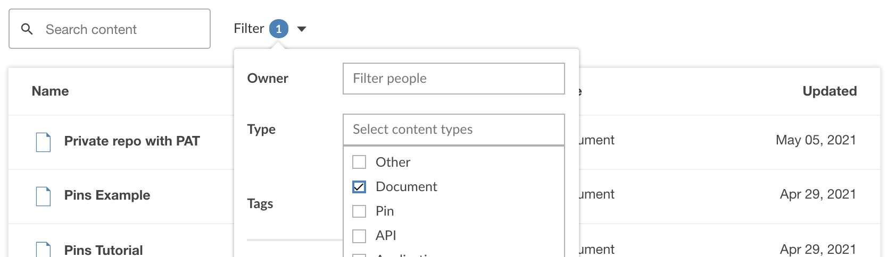

<!-- README.md is generated from README.Rmd. Please edit that file -->

# connectwidgets <a href='https://rstudio.github.io/connectwidgets'></a>

Curate your content on RStudio Connect

<!-- badges: start -->

[](https://CRAN.R-project.org/package=connectwidgets)
[](https://lifecycle.r-lib.org/articles/stages.html#stable)
[](https://github.com/rstudio/connectwidgets/actions)
[](https://github.com/rstudio/connectwidgets/actions/workflows/lint.yaml)
<!-- badges: end -->

`connectwidgets` is an R package that can be used to query an RStudio Connect server for a subset of your existing content items, then organize them within `htmlwidget` components in an R Markdown document or Shiny application.

Use `connectwidgets` to create a content hub or knowledge repository, a customized summary page for a particular group of stakeholders, or a presentation layer for any group of related content. 

## Installation

This package has not been released to CRAN yet and must be installed
from GitHub:

``` r
# install.packages("remotes")
remotes::install_github("rstudio/connectwidgets")
```

## Example

Use the template:

``` r
rmarkdown::draft("example-page.Rmd", template = "connectwidgets", package = "connectwidgets")
```

You can also copy and knit the following example, or read on for more
details:

```` markdown
---
title: an example page
output: html_document
---

```{r setup, include=FALSE}
library(connectwidgets)
library(dplyr)

knitr::opts_chunk$set(echo = FALSE, message = FALSE, warning = FALSE)

client <- connect(
  # server  = Sys.getenv("CONNECT_SERVER"),
  # api_key = Sys.getenv("CONNECT_API_KEY")
  )

all_content <- client %>%
  content()

sample_content <- all_content %>%
  arrange(desc(updated_time)) %>%
  slice_head(n = 50)
```


## Components

### card

```{r card}
sample_content %>%
  slice(1) %>%
  rsc_card()
```

### grid

```{r grid}
sample_content %>%
  rsc_grid()
```

### table

```{r table}
sample_content %>%
  rsc_table()
```

### search & filter

```{r search-and-filter}
rsc_cols(rsc_search(all_content), rsc_filter(all_content), widths = c(2, 2))
rsc_table(all_content)
```
````

### Setup

The client object:

-   Validates your API key with the RStudio Connect server
-   Ensures you are running a recent enough version of Connect

Use an `.Renviron` file to set the `CONNECT_SERVER` and
`CONNECT_API_KEY` environment variables. If you’re not familiar with
setting environment variables, check out the [R Startup
chapter](https://rstats.wtf/r-startup.html#renviron) of What They Forgot
to Teach You About R. RStudio Connect will [automatically
apply](https://docs.rstudio.com/connect/user/content-settings/#content-vars)
values for these at document run time, so there is no need to include
them in your code:

``` r
library(connectwidgets)
library(dplyr, warn.conflicts = FALSE)

knitr::opts_chunk$set(echo = FALSE, message = FALSE, warning = FALSE)

client <- connect(
  # server  = Sys.getenv("CONNECT_SERVER"),
  # api_key = Sys.getenv("CONNECT_API_KEY")
  )

all_content <- client %>%
  content()

glimpse(all_content)
#> Rows: 1,203
#> Columns: 15
#> $ id               <int> 3979, 4603, 4602, 5015, 5001, 5034, 1440, 5031, 5022,…
#> $ guid             <chr> "ca22a1f6-bab5-4fc0-8f38-ed8021be41f5", "e7c26684-ec4…
#> $ name             <chr> "github-issues-connect", "group-info", "user-info", "…
#> $ title            <chr> NA, "group-info", "user-info", "RSC+K8S", "New & Nota…
#> $ description      <chr> "A table pin with 19648 rows and 10 columns.", "Resul…
#> $ app_mode         <chr> "static", "static", "static", "static", "rmd-static",…
#> $ content_category <chr> "pin", "pin", "pin", "site", "", "", "", "", "", "", …
#> $ url              <chr> "https://rsc.radixu.com/content/ca22a1f6-bab5-4fc0-8f…
#> $ owner_guid       <chr> "1d6cc041-eb11-411e-810e-718508cde25b", "0fc96747-ec9…
#> $ owner_username   <chr> "brian", "kelly.obriant", "kelly.obriant", "aron", "k…
#> $ owner_first_name <chr> "Brian", "Kelly", "Kelly", "Aron", "Kelly", "E. David…
#> $ owner_last_name  <chr> "Smith", "@RStudio", "@RStudio", "Atkins", "@RStudio"…
#> $ tags             <list> [<data.frame[2 x 5]>], [<data.frame[1 x 5]>], [<data…
#> $ created_time     <dttm> 2020-04-03 17:54:27, 2020-12-05 02:37:30, 2020-12-05…
#> $ updated_time     <dttm> 2021-07-13 07:03:04, 2021-07-13 07:00:47, 2021-07-13…

sample_content <- all_content %>%
  arrange(desc(updated_time)) %>%
  slice_head(n = 100)
```

#### `content()`

`content()` returns a data frame with the following columns:

-   `id` - Auto-incrementing identifier for each content item (legacy)
-   `guid` - Unique identifier for each content item (preferred)
-   `app_mode` - The type of the content item (examples: `shiny`,
    `rmd-static`, `static`, `python-dash`, etc.)
-   `content_category` - For `static` app modes, the specific category
    of content (examples: `site`, `plot`, `pin`, etc.)
-   `name` - The name of the content item as set at initial publishing
-   `title` - The user-provided title of the content item
-   `description` - The user-provided description of the content item
-   `url` - The URL to the content item
-   `owner_guid` - Unique identifier of the owner of the content item
-   `owner_username` - Username of the owner of the content item
-   `owner_first_name` - First name of the owner of the content item
-   `owner_last_name` - Last name of the owner of the content item
-   `tags` - A data frame of the tags associated with the content item,
    with the following columns: `id`, `name`, `parent_id`,
    `created_time`, `updated_time`.
-   `created_time` - The timestamp at which the content item was created
-   `updated_time` - The timestamp at which the content item was last
    updated

The data frame contains one row for each item visible to the requesting
user. For users in an “administrator” role, that will be all content
items.

#### Filtering Content

We provide helper functions to filter by both owners and tags.

-   `by_tags()` - Filters the data frame to only include content that
    has been tagged with the specified tag name(s). You can pass a
    single tag name or a vector of tag names. `by_tag` is provided as an
    alias for readability when using a single tag.

-   `by_owners()` - Filters the data frame to only include content with
    the specified owner(s) by username. You can pass a single username
    or a vector of usernames. `by_owner` is provided as an alias for
    readability when using a single username.

``` r
all_content %>% 
  by_tag("Audit Reports")
#> # A tibble: 6 x 15
#>      id guid  name  title description app_mode content_category url   owner_guid
#>   <int> <chr> <chr> <chr> <chr>       <chr>    <chr>            <chr> <chr>     
#> 1  4875 7cbd… Audi… Audi… Using the … rmd-sta… ""               http… 0fc96747-…
#> 2  4619 b191… tag-… Tag … List all t… rmd-sta… ""               http… 0fc96747-…
#> 3  4618 4348… acl-… Cont… Generate a… rmd-sta… ""               http… 0fc96747-…
#> 4  4597 6a8f… cont… Basi… List all c… rmd-sta… ""               http… 0fc96747-…
#> 5  4596 3f7a… vani… Vani… List all d… rmd-sta… ""               http… 0fc96747-…
#> 6  4595 5687… envi… R an… R and Pyth… rmd-sta… ""               http… 0fc96747-…
#> # … with 6 more variables: owner_username <chr>, owner_first_name <chr>,
#> #   owner_last_name <chr>, tags <list>, created_time <dttm>,
#> #   updated_time <dttm>
```

Since `all_content` is a `tibble()`, you can also manipulate it with
dplyr:

``` r
all_content %>% 
  filter(updated_time >= "2021-01-01") %>% 
  arrange(created_time)
#> # A tibble: 67 x 15
#>       id guid    name    title  description    app_mode content_category url    
#>    <int> <chr>   <chr>   <chr>  <chr>          <chr>    <chr>            <chr>  
#>  1  1440 d7bf0e… cs_rep… cs_re… ""             rmd-sta… ""               https:…
#>  2  1890 be63ca… rmd     rmd4   "This rmd is … rmd-sta… ""               https:…
#>  3  3724 b5e57e… team-d… Team-… ""             static   ""               https:…
#>  4  3979 ca22a1… github… <NA>   "A table pin … static   "pin"            https:…
#>  5  4364 9ffbbd… shiny-… shiny… ""             shiny    ""               https:…
#>  6  4602 e21598… user-i… user-… "Results pull… static   "pin"            https:…
#>  7  4603 e7c266… group-… group… "Results pull… static   "pin"            https:…
#>  8  4630 f12eb8… top-5-… top-5… ""             python-… ""               https:…
#>  9  4631 68c9b2… top-5-… top-5… ""             python-… ""               https:…
#> 10  4650 ebdea3… reticu… retic… ""             static   ""               https:…
#> # … with 57 more rows, and 7 more variables: owner_guid <chr>,
#> #   owner_username <chr>, owner_first_name <chr>, owner_last_name <chr>,
#> #   tags <list>, created_time <dttm>, updated_time <dttm>
```

### Components

Once your content data are filtered, `connectwidgets` provides
components for displaying information about them. The title,
description, and preview image can be set [from the RStudio Connect
dashboard.](https://docs.rstudio.com/connect/user/content-settings/#content-metadata)
For content deployed to Connect where no image has been supplied, a
default image will be used.

*Note:* In many cases, you will only see default images until your
content is deployed.

#### card

Use a card to highlight an individual piece of content:


#### grid

Display multiple content items via a grid:


#### table

Provide a more detailed view with a table:


#### search & filter

The search and filter components help viewers find the content they are
most interested in. You must pass the same content data frame to
`rsc_search()`, `rsc_filter()`, and `rsc_table()` or `rsc_grid()` in
order for filter and search to work. You can also create your own
`crosstalk::SharedData()` object to pass to the components if you want
more control over searching and filtering. Read more at
`vignette("using-crosstalk")`.



## Theming

`connectwidgets` components support styling in
`rmarkdown::html_document` via the
[`bslib`](https://rstudio.github.io/bslib/) package. You can supply a
[Bootswatch theme](https://bootswatch.com/4/) in the yaml header, e.g.:

``` yaml
---
output:
  html_document:
    theme:
      bootswatch: minty
---
```

or pass a custom theme consistent with your organization’s style:

``` yaml:
---
output:
  html_document:
    theme:
      bg: "#FFF"
      fg: "#22333B" 
      primary: "#4F772D"
      dark: "#252525"
      light: "#DCE6D3"
      base_font: "Lato, sans-serif"
      heading_font: "Lato, sans-serif"
      border-color: "#E9F5DB"
      gray-100: "#F7FCF0"
---
```

Once you’re happy with the look of your page, Publish it to RStudio
Connect. Read more at `vignette("publishing")`.

## A more customized example:

Putting it all together, the example API portal page below:

-   uses CSS to create a full-width image with inset text
-   uses a Bootswatch theme
-   overrides the `description` text for a couple of cards

If no APIs are deployed on your RStudio Connect server, try filtering
for static documents or Shiny apps instead.

```` markdown
---
output:
  html_document:
    theme:
      bootswatch: lumen
---

```{css, echo=FALSE}
.main-container {
    width: 100%;
    max-width: unset;
}

.main {
    max-width: 940px;
    margin-left: auto;
    margin-right: auto;
}

/* https://codepen.io/eversionsystems/pen/YOmqdj */
.jumbotron {
  color: white;
  background-image: url("https://source.unsplash.com/d30sszrW7Vw/1920x1080");
  background-position: center;
  background-repeat: no-repeat;
  background-size: cover;
  height: 50vh;
}
```

```{r, include=FALSE}
library(connectwidgets)
library(dplyr)
library(htmltools)

knitr::opts_chunk$set(
  comment = "",
  echo = FALSE, warning = FALSE, message = FALSE
)

rsc_content <-
  connect() %>%
  content()

apis <- rsc_content %>%
  filter(app_mode %in% c("api", "python-api"))
```

```{r}
div(
  class = "jumbotron jumbotron-fluid",
  div(
    class = "container",
    h1("Connect API Portal", class = "display-4"),
    p("Model APIs maintained by the data science team")
  )
)
```

```{r}
div(
  class = "main",
  h3("Featured APIs", class = "text-center"),
  {
    model_copy <- c(
      "Our most important model: Distillery retro taiyaki fashion axe.
      Art party cray intelligentsia flexitarian.",
      "Our second most important model: Pug af twee portland pitchfork brunch
      kogi gochujang organic migas shaman four dollar toast 90's slow-carb."
      )

    apis %>%
      slice_head(n = 2) %>%
      mutate(
      description = model_copy
      ) %>%
      rsc_card()
  },
  h3("All APIs", class = "text-center"),
  p("that thing George Box said one time. You know what thing."),
  {
    tagList(
      rsc_cols(rsc_search(apis), rsc_filter(apis)),
      rsc_grid(apis)
    )
  }
)
```
````
